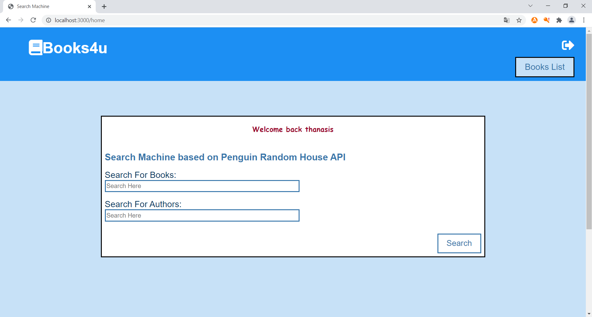
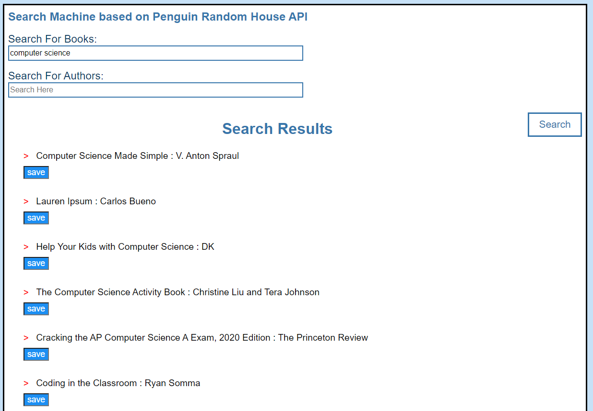
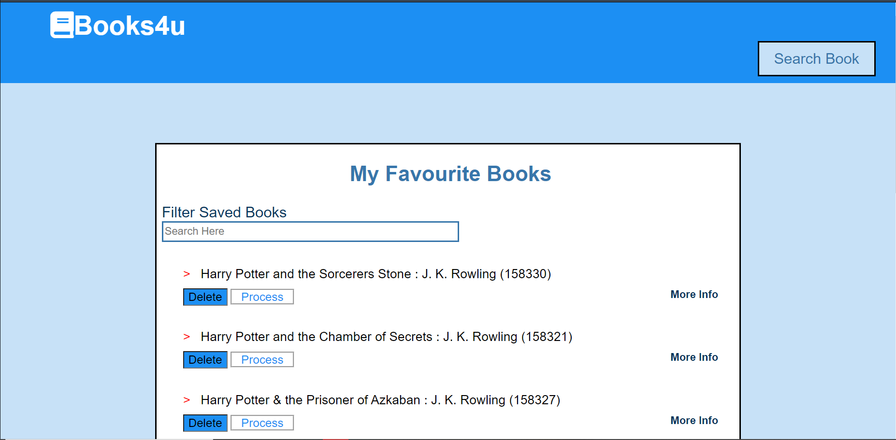
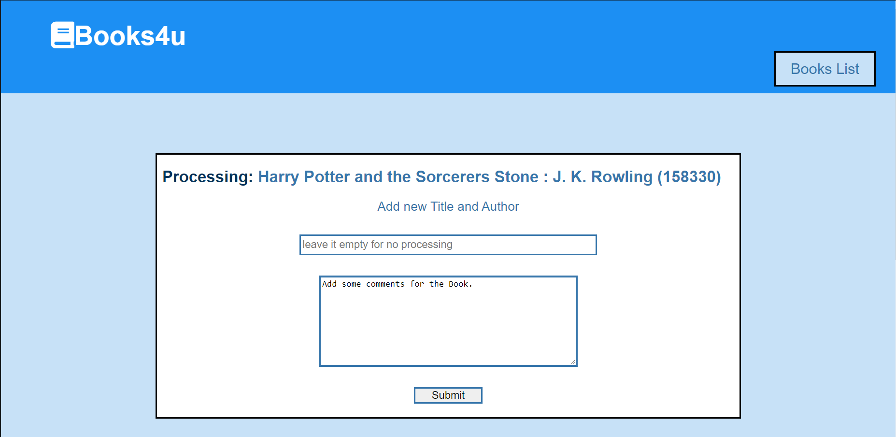

# Books4u
Books4u is a web development project that contains a website where a user can search, save, edit a book.  
Books4u uses the web API: Penguin Random House that you can find **[here](http://www.penguinrandomhouse.biz/webservices/rest/)**.
Books4u website consists of:  
## 1. The Login Screen

## 2. The Register Screen

## 3. The Main Screen
In this screen a user can search a book.

The search results have the following form:

## 4. Favourite Books Screen
The favourite books are displayed on this screen and the user has the option to delete or edit a book from the list. 
The user can look for more information about the book too. 

## 5. Edit Screen
In this screen user can edit the book by changing its title and author.

Also the user can comment a book and the results will appear in Favourite Books Screen.

  

## Libraries-Frameworks :
- Handlebars
- Node.js
- Express
- EJS
- Fetch API

## Database
- MongoDB using Bcryptjs to store the password for security reasons